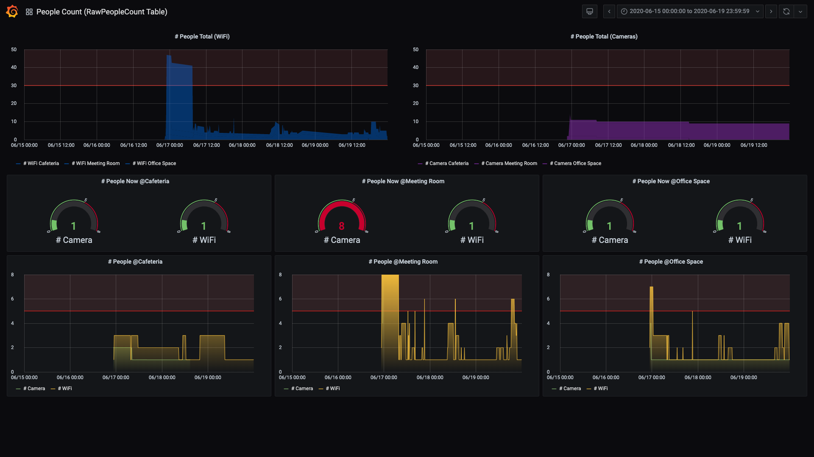
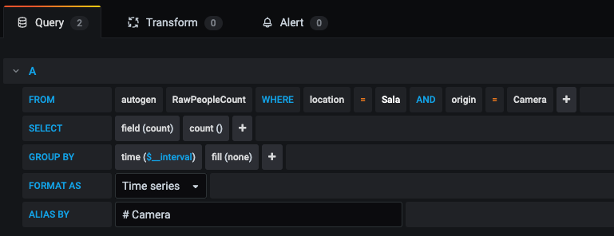

# Grafana

We are using Grafana (https://grafana.com/) as the tool to build a dashboard that can help the workplace administrator to understand and visualize, based on the differente sensor data collected, how is the office spaces utilization over the time.

Grafana today is used in lots of Open Source projects since it's very easy and intuitive to start building dashboards. It allows you to query, visualize, alert on, and explore your metrics with great flexibility regarding of where the data is stored.

In this project Grafana is quering the data from different sensors (WiFi, Cameras), located in different areas or rooms of the workspace like in our example dashboard that represents the cafeteria, meeting room and open office space utilization. The administrator also has an overall understanding of the office utilization when stacking the sensor information from all the individual spaces.

This is an initial dashboard using Influx native queries, but more complex queries can be done using the Grafana plugins for InfluxQL or Flux.

## Grafana Instalation

We are using a standard installation of the Grafana Open Source or OSS. Depending of the operational system that you are using, follow the documentation to install it: https://grafana.com/docs/grafana/latest/installation/

## Grafana Configuration

After it's installed, you should be able to access the Grafana GUI via the server ip address in the port 3000.

Grafana has the concept of Dashboards and inside the Dashboards you create Panels. In our example we are using a single Dashboard with multiple panels inside it.

Here in this directory we have a JSON file (grafana_dashboard_example.json) that can be imported (Left menu "+" -> import) to your setup that will create the main dashboard with some panels. When you first load it, you need to edit each panel and define your room names to get the graphics plot going. You do this editing the influx query in each panel as in this example, changing the location from Sala to your Room's name.

